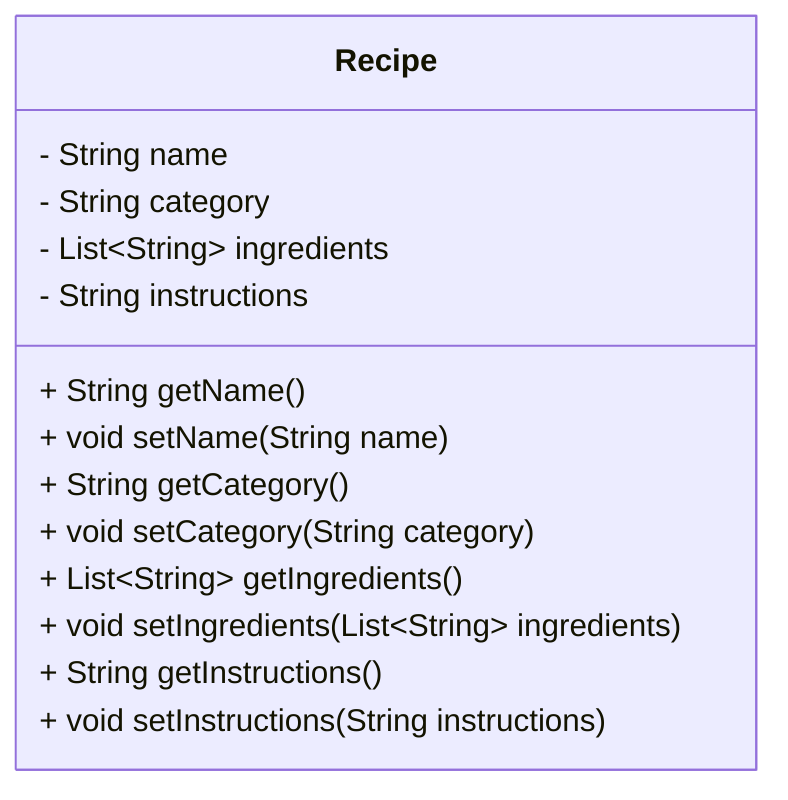

For my final project I have a recipe manager. Using this app, you are able to add different recipes to different categories i.e breakfast, lunch, and dinner, with their igredients, quantity of ingredients, and instructions. You are also able to view these reciped grouped in their categories, search for them, edit them and delete if needed. The target users for this app include people who really enjoy cooking and would like to have their favorite recipes organized and people who really struggle to cook, with this app they can save their favorite recipes and make modifications. 

The app begins at the mainscreen where there are three buttons: Add Recipes, View Recipes, and Delete Recipes. When you click "Add Recipes", you open up a screen where you can enter the recipe name, select a category (Breakfast, Lunch, or Dinner), add ingredients (with name and quantity), and input cooking instructions. Once that is all filled out, you can click "Save". After saving, it takes you back to the mainscreen where you can click "View Recipes" which shows you all the saved recipes grouped into their various categories. There is also a search bar to filter the recipes by name. You also have the option to edit the recipe. Users can update existing recipes by changing the name, category, ingredients, or instructions. After making changes, the recipe is saved, and the app updates the list of recipes accordingly.
Lastly, we have the delete recipes screen which shows the list of all the saved recipes with which you can delete them if you no longer need them.

Using an emulator, I can connect my code to run on my android device. 
Here is how you can use the key features of my app. 
To add a recipe, you can go to the "Add Recipe" screen, fill out the recipe form with its name, category, ingredients, and instructions. Then you click save to store this recipe. Then you go to the "View Recipes" screen where you can see all the stored recipes in their various categories. You can use the search bar or scroll to find your desired recipe where you can tap on it to see its details. If you tap "Edit" you can modify the recipe's name, ingredients, instructions, or category. After that, click "Save changes". From the "Delete Recipes" screen, you can select a recipe to delete. Confirm the deletion in the pop-up dialog, and the recipe will be removed from the list.

You can test it by adding a new recipe with different categories and ingredients. Ensure the recipe is saved and visible in the "View Recipes" section after you save it. Use the search bar to filter recipes by name and ensure it works correctly. Edit an existing recipe and verify that the changes are saved and displayed correctly in the list. Select a recipe to delete, confirm the deletion, and check that it’s removed from the list.

One of the biggest problems I faced was trying to manage multiple ingredients with their quantities, and how I could make that look clean and neat. I used a list of maps and custom formatting (e.g., "Eggs (2)") to keep it simple. Another big issue I faced was with syncing edited recipes in the list. I used setState and index tracking. I started with making my own Python tinker code, and used AI (ChatGpt) to turn it into a Flutter app. AI helped a lot with understanding how to save my recipes, grouping them into categories etc. It guided me through common Flutter issues like form validation, dynamic UI updates, and file handling.

If I had more time, I would like to be able to make my app import recipes from the internet and save it, instead of filling it out manually. I would add more categories like snacks, dessert etc. I would like for the recipes in the delete recipes screen also to be categorized. 

